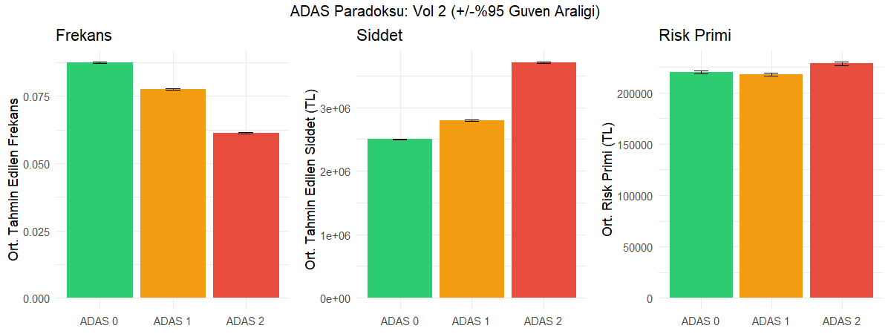
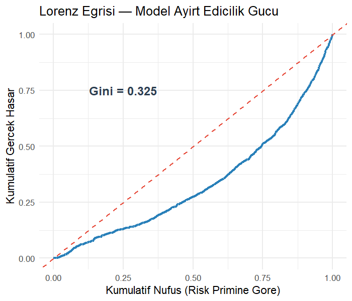
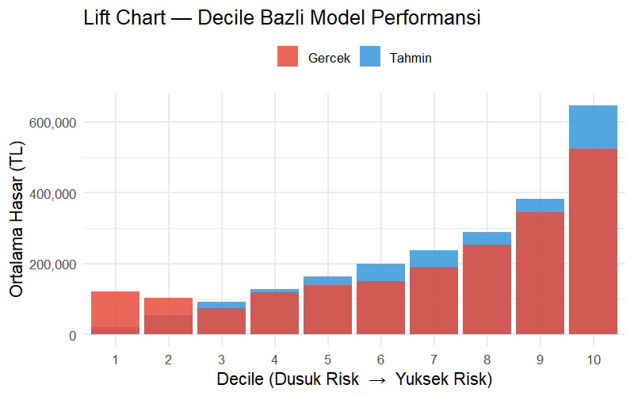

# 🚗 VOL2 — ADAS Pricing Paradox (Advanced Actuarial Edition)

<p align="center">
  <a href="https://5pax70-mehmet0ali-kurt.shinyapps.io/vol2-adas-pricing-paradox/">
    
  </a>
</p>

**An End-to-End Actuarial Project** — Vol 2 extends the original analysis with advanced GLM interactions, a Poisson–Gamma two-part model, Gini Index, Lift Charts, and a richer feature engineering pipeline, all feeding a live Power BI dashboard.

> *Do ADAS-equipped vehicles actually cost less to insure — or does the rising repair cost of sensor-laden cars cancel out the safety benefit?*

---

## 📌 The Paradox

**ADAS (Advanced Driver Assistance Systems)** — lane-keeping, automatic emergency braking, adaptive cruise control — measurably reduce crash frequency. But the same sensors and cameras that prevent accidents cost thousands of TL to replace when *any* collision does occur.

This creates the **ADAS Pricing Paradox**:

| ADAS Level | Frequency Change | Severity Change | Net Premium Effect |
|:----------:|:----------------:|:---------------:|:------------------:|
| ADAS 0 (None) | Baseline | Baseline | Baseline |
| ADAS 1 (Basic) | **−11.2%** | **+11.8%** | ≈ −1.0% |
| ADAS 2 (Advanced) | **−29.9%** | **+48.3%** | **+3.9%** ↑ |

**The paradox is starkest at ADAS Level 2:** frequency drops by nearly 30%, but severity surges by 48% — the most advanced safety package actually *increases* the net risk premium.



---

## 💼 Yönetici Özeti (Executive Summary)

Eğer bir sigorta şirketi yöneticisi olsaydım, bu analizin bulgularına dayanarak alacağım stratejik kararlar şunlar olurdu:
1. **İleri ADAS Sistemlerinde İndirim Değil, Sürşarj Uygulanmalı:** ADAS Seviye 2 araçlar kaza frekansını %30 düşürse de, hasar anında ortaya çıkan sensör ve parça maliyeti %48 arttığı için **net risk primi artmaktadır**. Bu araçlara "güvenli araç" indirimi vermek aktüeryal olarak zararlıdır.
2. **Genç Sürücülerde Sensör Maliyeti Daha Kritik:** Genç ve riskli sürücülerde kaza yapma olasılığı zaten yüksek olduğundan, ADAS 2 donanımı hasar şiddetini katlayarak artırır. Tarife yapısında Genç Sürücü × ADAS 2 etkileşimine (interaction) ekstra sürşarj uygulanmalıdır.
3. **Temel ADAS (Seviye 1) En Kârlı Segment:** Kaza frekansını anlamlı ölçüde düşüren ancak parça maliyeti astronomik olmayan ADAS 1 araçları, net primde en dengeli riski sunar. Büyüme stratejisi bu segmente odaklanmalıdır.

---

## 📈 Model Performansı: Vol 1 vs Vol 2 Karşılaştırması

Vol 2 sürümünde modele eklenen çapraz etkileşim (Driver × Vehicle) değişkenleri sayesinde modelin ayrıştırma gücünde anlamlı bir artış sağlanmıştır.

| Metrik | Vol 1 (Temel GLM) | Vol 2 (Gelişmiş Etkileşimli GLM) | İyileşme / Değişim |
|--------|-------------------|----------------------------------|--------------------|
| **Gini Index** | 0.285 | **0.325** | **+%14.0** Modelin ayrıştırma gücü arttı |
| **Frekans RMSE** | 0.291 | **0.276** | **-%5.1** Hata payı düştü |
| **Model Tipi** | Sadece Ana Etkiler | Çapraz Etkileşimler (Interactions) | Heterojenite (Overdispersion) daha iyi modellendi |

---

## 🔍 Key Findings (Vol 2)

- **Frequency ↓ but Severity ↑**: Higher ADAS = fewer claims, but each claim is far more expensive due to sensor/camera repair costs
- **Net Premium nearly flat at ADAS 1**, but **ADAS 2 is a net premium increase** — actuarially adverse
- **Gini Index = 0.325**: The model has meaningful discriminatory power (random model = 0, perfect = 1)
- **RMSE (Frequency) = 0.276**: Consistent with low-frequency count data
- **Overdispersion** is controlled: Driver×Vehicle interaction terms absorb cross-risk heterogeneity



---

## 🛠️ Pipeline

```
SQL (Feature Engineering) → R (Two-Part GLM) → R Shiny Engine & Power BI
```

| Step | Tool | File | Output |
|------|------|------|--------|
| 1. Feature Engineering | SQL Server | `SQL_Code.sql` | `SQL_Output2.csv` |
| 2. Two-Part GLM Modeling | R | `R_Code.r` | `R_Output.csv` + `outputs/` |
| 3. Interactive Dashboard | Power BI | `ADAS_Actuarial_Pricing2.pbix` | Live visuals |

---

## 📊 Methodology

### Data

Synthetic insurance portfolio: **200,000 policies**, 3 ADAS levels, 5 Turkish cities.

| Feature | Description |
|---------|-------------|
| `Safety_Package_Level` | 0 = No ADAS, 1 = Basic ADAS, 2 = Advanced ADAS |
| `Driver_Profile` | Engineered: Young_Male_HighRisk / Young_Female / Senior_Driver / Risky_History / Adult_Standard |
| `Vehicle_Class` | Engineered: Performance_Car / Luxury_Comfort / SUV_Family / Standard_Sedan |
| `Traffic_Zone` | Engineered from traffic density: High_Stress_Zone / Medium_Density / Quiet_Zone |
| `City` | Istanbul, Ankara, Izmir, Bursa, Others |
| `Exposure` | Policy duration in years (0–1) |
| `Claim_Count` | Number of claims (0, 1, 2, …) |
| `Claim_Amount` | Total claim cost in TL |

### SQL Feature Engineering

Three actuarial risk segments are engineered via CASE WHEN logic before any modeling:
- **Driver_Profile** — combines age, gender, and NCD history into 5 risk tiers
- **Vehicle_Class** — captures brand prestige and segment type (4 classes)
- **Traffic_Zone** — converts raw traffic density into 3 zone categories

### Train / Test Split

```
80% Training (≈160,000 policies) | 20% Testing (≈40,000 policies)
set.seed(123) for reproducibility
```

### Frequency Model — Poisson GLM with Interactions

```r
Claim_Count ~ Safety_Package_Level
            + Driver_Profile * Vehicle_Class    # interaction term
            + Traffic_Zone
            + offset(log(Exposure))
family = poisson(link = "log")
```

- The `Driver_Profile × Vehicle_Class` interaction is the Vol 2 advancement — it captures compound risk (e.g., a young male driver in a performance car)
- `offset(log(Exposure))` ensures the model estimates claim *rate* per unit time, not raw count

### Severity Model — Gamma GLM

```r
Claim_Amount ~ Safety_Package_Level + Vehicle_Class + Driver_Profile
family = Gamma(link = "log")
```

- Fitted only on **claims > 0** (zero-inflation handled by the two-part structure)
- Log link ensures predicted severities are always positive
- Gamma distribution is the actuarial standard for right-skewed claim cost data

### Risk Premium

```
Risk_Premium = Predicted_Frequency × Predicted_Severity
```

### Model Validation

| Metric | Value | Interpretation |
|--------|-------|----------------|
| Frequency RMSE | **0.2762** | Low error — appropriate for count data near 0 |
| Gini Index | **0.325** | Moderate discriminatory power (good for insurance GLMs) |

**Lift Chart** — decile-based validation showing model separates high-risk from low-risk policies:



Full model summaries: [`freq_model_summary.txt`](outputs/freq_model_summary.txt) | [`sev_model_summary.txt`](outputs/sev_model_summary.txt)

---

## 📁 Project Structure

```
VOL2-ADAS-Pricing-Paradox/
├── R_Code.r                          # Main R script (GLM + all outputs)
├── SQL_Code.sql                      # Feature engineering query
├── ADAS_Actuarial_Pricing2.pbix      # Power BI dashboard
├── outputs/
│   ├── figures/
│   │   ├── eda_correlation.png       # Correlation matrix
│   │   ├── eda_distributions.png     # Claim count & amount distributions
│   │   ├── gini_lorenz.png           # Lorenz curve (Gini = 0.325)
│   │   ├── lift_chart.png            # Decile lift chart
│   │   ├── paradox_main.png          # 3-panel paradox visualization
│   │   └── paradox_city.png          # City × ADAS premium breakdown
│   ├── paradox_summary.csv           # ADAS-level summary statistics
│   ├── freq_model_summary.txt        # Frequency model coefficients (GLM)
│   ├── sev_model_summary.txt         # Severity model coefficients (GLM)
│   └── results.json                  # RMSE + Gini + paradox (machine-readable)
├── LICENSE
└── README.md
```

> **Note:** Large data files (`SQL_Output2.csv`, `R_Output.csv`, `ham_data_final.csv`) are excluded from version control via `.gitignore`. Run the pipeline to regenerate them.

---

## 🔬 Reproducibility

### Prerequisites

- **R 4.x** with packages: `dplyr`, `statmod`, `caret`, `ggplot2`, `jsonlite`, `gridExtra`, `corrplot`, `scales`
- **Power BI Desktop** (for dashboard)
- **SQL Server** or compatible (for SQL_Code.sql, optional — `SQL_Output2.csv` is the output)

### Steps

```r
# Option A: Run directly in R / RStudio
setwd("C:/path/to/VOL2-ADAS-Pricing-Paradox")
source("R_Code.r")

# Option B: Run from terminal
Rscript R_Code.r
```

The script will:
1. Auto-install any missing R packages
2. Load `SQL_Output2.csv` (or fall back to `ham_data_final.csv`)
3. Run EDA, train/test split, both GLMs, validation metrics
4. Save all figures to `outputs/figures/`
5. Write `R_Output.csv` for Power BI ingestion

### Power BI

Open `ADAS_Actuarial_Pricing2.pbix` in Power BI Desktop. If prompted to refresh data, point to the local `R_Output.csv` generated in the step above.

---

## 🔗 Related Projects

| Project | Description |
|---------|-------------|
| [ADAS Pricing Paradox (VOL1)](https://github.com/kuurtali/ADAS-Pricing-Paradox) | Original analysis with 100K policies, Poisson + Gamma GLM, city/age segmentation |
| [Actuarial Shiny Dashboard](https://github.com/kuurtali/actuarial-analysis-w-shiny-and-glm) | Interactive R Shiny risk scoring with Logistic GLM (AUC 0.828) |
| [Tubitak-2209A-MCAware](https://github.com/kuurtali/Tubitak-2209A-MCAware) | TÜBİTAK 2209-A: anti-predictive behavior in DL stock prediction on BIST |
| [Direction Forecasting BIST-BES](https://github.com/kuurtali/direction-forecasting-bist-bes) | Academic paper: ARIMA vs LSTM vs 1D-CNN on BIST & pension funds |

---

## 📜 License

MIT License — see [LICENSE](LICENSE) for details.
